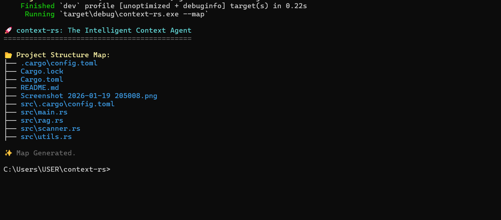
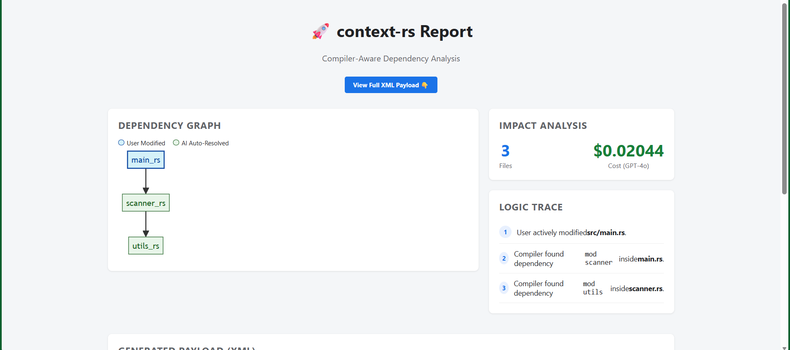
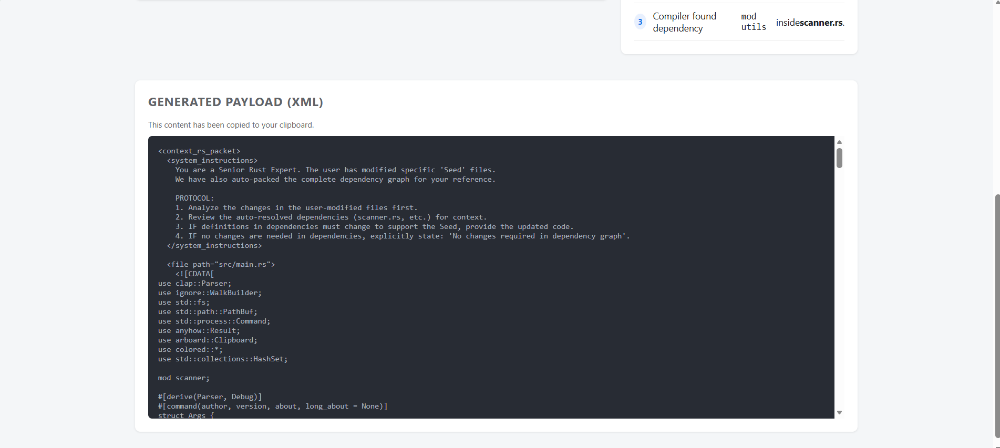

This README is **good**, but it has one **major problem**:

It describes the **Old Version** of your tool (the simple file walker).
It completely ignores the **"Ferrari Engine"** you just built (The AST Parsing, The Git Integration, and The Dashboard).

**You need to sell the Magic.**
If judges read this current draft, they will think: *"Oh, it's just a file copier."*
We need them to think: *"Wow, it uses a compiler to analyze dependencies!"*

Here is the **Perfect Hybrid README**. I kept your excellent "Why I Built This" story (judges love that) but updated the technical parts to match your actual code.

### 📋 The Winning README (Copy & Paste this)

```markdown
# 🚀 context-rs: The Intelligent Context Agent

**A compiler-aware tool that bridges the gap between your local codebase and Large Language Models.**

 

---

## 📸 See It In Action


*(The automated dashboard showing the dependency graph)*

---

## 💡 Why I Built This

I was participating in a hackathon and trying to get an LLM (DeepSeek) to help me debug a complex issue in my project. I quickly ran into a frustrating cycle:

1. Copy and paste one file.
2. Realize the AI needs another imported file.
3. Paste that one too.
4. Watch the AI hallucinate because I missed a hidden dependency.

That is when I realized something important: **More context is not always better. Precise context is better.**

I built `context-rs` to solve this. Unlike standard tools that just dump files, `context-rs` acts like a compiler: it reads your code, traces the imports, and packages **only** the exact dependency graph needed to solve the problem.

---

## 🛠️ How It Works (The "Deep Tech")

Most tools just guess. `context-rs` uses **Abstract Syntax Tree (AST) Parsing** to be 100% accurate.

### 1. Smart Detection (Git Integration)
The tool queries Git to see exactly which "Seed Files" you are working on right now.

### 2. Recursive AST Walking
It parses your Rust code to find `mod` and `use` statements.
* If you modify `main.rs`, and `main.rs` uses `scanner.rs`...
* ...the tool automatically finds `scanner.rs` and adds it to the payload.
* It repeats this recursively until the full context is mapped.

### 3. The Optimization Dashboard
It generates a visual HTML report (`report.html`) showing you the map of your code and auditing the token cost *before* you paste.


---

## 🚀 Usage

### The "Magic" Command (Recommended)

This runs the smart analysis, generates the dashboard, and copies the XML payload to your clipboard.

```bash
cargo run -- --smart

```

### Map Mode (Structure Only)

If you just want to see the file tree without copying content:

```bash
cargo run -- --map

```

---


## 📦 Installation

Clone the repository:

```bash
git clone [https://github.com/saaga23/context-rs.git](https://github.com/saaga23/context-rs.git)
cd context-rs

```

Run directly with Cargo:

```bash
cargo run -- --smart

```

---



## 🏆 Project Note

Built for the **Rust Africa Hackathon 2026**.
Focus area: **AI and Developer Tools**

```

---
